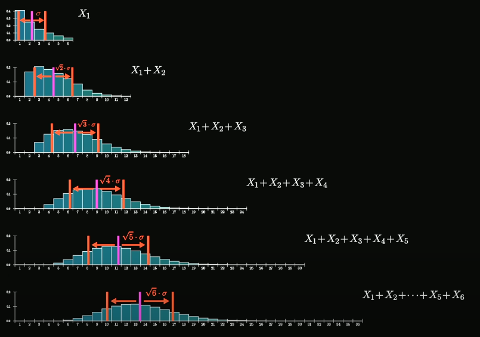

## Central Limit Theorem

General Idea
- start with a random variable X
- Add N samples of this variable : X_1 + X_2 + ... + X_N
- The distribution of this sum looks more like a bell curve as N → ∞

$$
\mathrm{Var}(X+Y) = \mathrm{Var}(X) + \mathrm{Var}(Y) \text{(Assuming $X$ and $Y$ are independent!)}
$$

$$
\sigma^{2}_{X_1 + \cdots + X_n} = n \cdot \sigma^{2}_{X_1}
$$

$$
\sigma_{X_1 + \cdots + X_n} = \sqrt{n} \cdot \sigma_{X_1}
$$

- When we relign all of these distributions so that the means are the same and rescale them that all of the standard deviations are just going to be eual to 1
  - → The results shape gets closer and closer to a certain universal shape

$$
\text{Standard normal distribution with N(0,1): } \frac{1}{\sqrt{2\pi}} e^{-\tfrac{1}{2}x^{2}}
$$

$$
\text{Normal distribution with N(μ,σ): } \frac{1}{\sigma \sqrt{2\pi}}  e^{-\tfrac{1}{2} \left( \tfrac{x - \mu}{\sigma} \right)^{2}}
$$

---

## Reference
https://www.youtube.com/watch?v=zeJD6dqJ5lo
