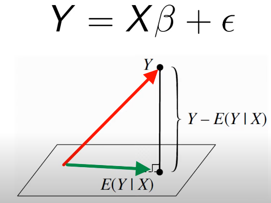
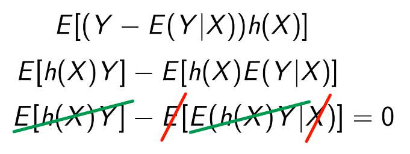
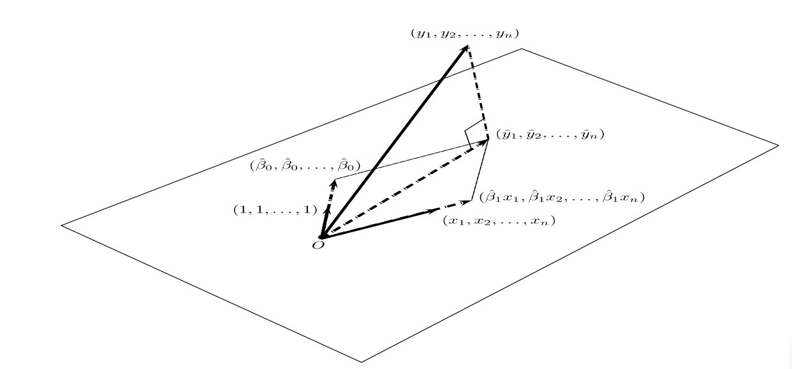

## Geometric Interpretation of OLS

- X의 벡터들과 B의 벡터들이 아래 평면을 형성함
- **red line** : Y 벡터
- **green line** : XB-hat의 선형결합을 통해 형성된 벡터임
- **height** : ε = Y - E(Y|X), 즉 오차벡터가 됨

- XB와 ε는 서로 직교함 
  - 이제 error term ε가 평면에 직교함(orthogonal)을 증명해보자
  - Y를 X의 함수공간으로 직교투영한 점이 E(Y|X)
  - 아래 수식이 조건부기대값의 성질에 의해 0이 됨을 확인할 수 있고
  - 즉, Y-E(Y|X) (오차항)과 X의 함수들 h(X)는 직교함
  - 따라서 추정치 추정치 𝑋𝛽^와 잔차 ε는 서로 직교

---

$$
\begin{aligned}
& X^{\mathsf T} \vec{e} = 0 \\
& X^{\mathsf T}(y - \hat{y}) = X^{\mathsf T}(y - X\hat{\beta}) = 0 \\
& X^{\mathsf T}y - X^{\mathsf T}X\hat{\beta} = 0 \\
& X^{\mathsf T}X\hat{\beta} = X^{\mathsf T}y \quad \text{(normal equation)} \\
& \therefore \hat{\beta} = (X^{\mathsf T}X)^{-1}X^{\mathsf T}y
\end{aligned}
$$

---

---

## Reference
https://www.youtube.com/watch?v=4rxSesLVgBA
