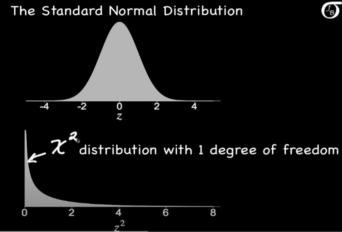

## `01` Random Variable
$$
X : \Omega \to \mathbb{R} \quad \text{A real valued function}
$$

즉, X는 표본공간 Omega의 원소(사건)을 입력으로 받아, 
실수값(R)을 출력하는 함수이다.

$$
X \sim \mathbb{P} \quad \text{: $X$ has distribution $\mathbb{P}$}
$$

$$
\mathbb{P}(X \in A) = \mathbb{P}(\{\omega \in \Omega : X(\omega) \in A\})
$$

즉, 확률변수 X가 집합 A에 속할 확률은, 표본공간에서 X가 A에 들어가는 사건들의 확률과 같다.

---

## `02` Important Distributions
#### `02-1` Chi-squared distribution
If a random variable Z has the standard normal distribution, then Z^2 has the chi-squared distribution with one degree of freedom. 

if Z1, Z2, ..., Zk are independent standard normal random variables, then 

$$
Z_1^2 + Z_2^2 + ... + Z_k^2
$$

has a chi-squared distribution with k degrees of freedom.

Thus, degrees of freedom = 'number of independent squared standard normal random variables'

The probability density function of chi-squared distribution with k degrees of freedom:

$$
f(x) = \frac{x^{k/2 - 1} e^{-x/2}}{2^{k/2} \, \Gamma(k/2)} 
\quad \text{for } x \geq 0
$$

mean of chi-squared distribution = k
variance of chi-squared distribution = 2k

Hard right-skewness when having small degrees of freedom. when degrees of freedom increases, the distribution becomes more symmetric.
In 3 df, mean = 3, variance = 6
In 12 df, mean = 12, variance, = 24

An Hypothesis test with chi-squared distribution.
Case study : 수학과의 시험 점수의 표준편차는 8.6이다. 교수는 이 값이 더 작다고 생각한다. 그는 20개의 시험 점수를 샘플링하여 표준편차는 6.9임을 발견한다. 이 표본들이 충분한 증거를 제공하는지, true 표준편차가 8.6보다 작다는 것에 대해? 이때 유의수준(significance level)은 0.05로 설정한다.

가설에 따른 분산 $ \theta_0^2 $ = 8.6^2
표본 분산 $ S^2 $ = 6.9^2

#### `02-2` T distribution
#### `02-3` F distribution

