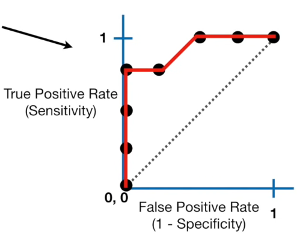
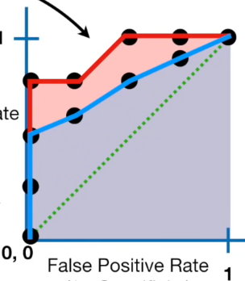

- after the classifing the samples based on logistic regression
- we can draw a confusion matrix then we can calculate the Sensitivity and Specificity
  - **Sensitivity** 민감도 : TP / TP + FN
  - **Specificity** 특이도 : TN / TN + FP
- 여기서 threshold를 바꿀 때마다 매번 confusion matrix가 생성되는데 대신 ROC 그래프를 활용하면 한 번에 요약 가능 

## ROC (Receiver Operator Characteristic)

- Y : True Positive Rate : Sensitivity
- X : False Positive Rate : 1 - Specificity
- ROC Graph는 각 threshold에 따른 confusion matrix들의 결과를 요약함 

## AUC (Area Under the Curve)

- AUC는 서로 다른 ROC를 비교하는데 유용함
- 예로 Red ROC curve(Logistic Regression)가 Blue ROC curve(Random Forest) 보다 좋은 모델링을 했다고 할 수 있음
  - Logistic Regression 선택!

---

## Reference
https://www.youtube.com/watch?v=4jRBRDbJemM
